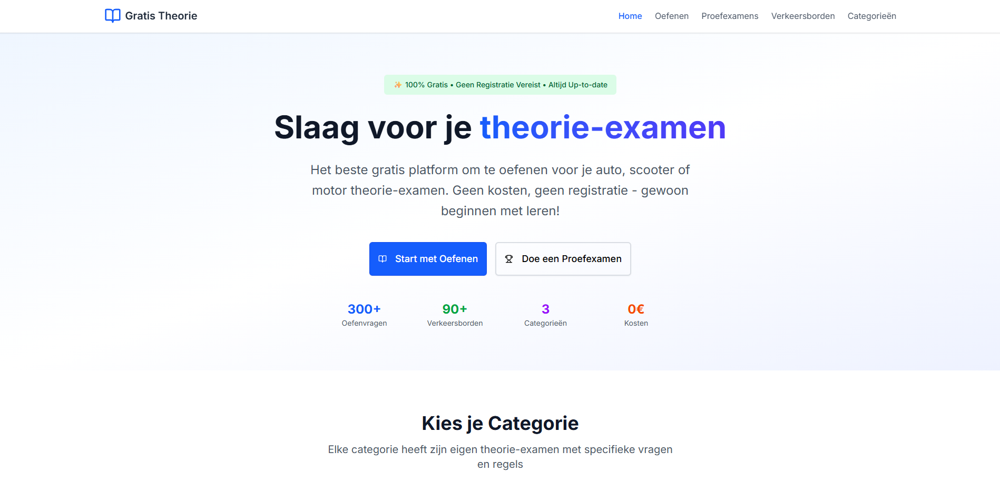

# Gratis Theorie - Oefenplatform voor het Theorie-examen

  
  
  
  

**Oefen gratis en onbeperkt voor je theorie-examen auto, motor of scooter met realistische CBR-vragen.**

  
  

## Over Gratis Theorie

*Gratis Theorie* is een modern, interactief leerplatform waarmee je je optimaal kunt voorbereiden op je theorie-examen voor de auto, motor of scooter. Met realistische oefenvragen, proefexamens, en een uitgebreide verkeersbordenbibliotheek is dit hét platform voor iedereen die wil slagen — gratis en zonder limieten.

## Inhoudsopgave

- [Functionaliteiten](#functionaliteiten)  
- [Technologieën](#technologieën)  
- [Paginastructuur](#paginastructuur)  
- [Roadmap](#roadmap)  
- [Bijdragen](#bijdragen)  
- [Licentie](#licentie)  
- [Versie](#versie)  
- [FAQ](#faq)  
- [Contact](#contact)

## Functionaliteiten

-  **Oefenmodules** — Realistische vragen per categorie, zoals voorrang, verkeersborden, etc.  
-  **Proefexamens** — Ervaar hoe het echte theorie-examen voelt.  
-  **Verkeersborden** — Leer alle Nederlandse verkeersborden met visuele ondersteuning.  
-  **Voortgangsmeting** — Houd je prestaties en groei bij.  
-  **Mobile-friendly** — Oefen altijd en overal, op mobiel, tablet of desktop.  
-  **Meertalige ondersteuning** — Nederlands, Engels en meer in de toekomst.

## Technologieën

  
  
  
  
  
  
  
  

## Paginastructuur

- **Home** — Introductie tot het platform met duidelijke call-to-actions.
- **Oefenen** — Selecteer categorieën en oefen per onderwerp.
- **Proefexamens** — Neem volledige proefexamens af zoals bij het CBR.
- **Verkeersborden** — Alle verkeersborden overzichtelijk met uitleg.
- **Categorieën** — Oefenmateriaal per voertuigtype (Auto, Motor, Scooter).

## Roadmap

- **v1.0.0** — Eerste publieke release met basisfunctionaliteiten
- **v1.1.0** — Toevoeging van dark mode en lichte modus
- **v1.2.0** — Meertalige ondersteuning voor Nederlands en Engels
- **v1.3.0** — Gebruikersregistratie en persoonlijke voortgang
- **v2.0.0** — AI-ondersteund leren en aanbevelingen

## Bijdragen

Bijdragen zijn van harte welkom! Volg deze stappen om bij te dragen:

1. Fork deze repository  
2. Maak een feature branch (`git checkout -b feature/naam`)  
3. Commit je wijzigingen met duidelijke berichten  
4. Dien een Pull Request in

> *Samen bouwen we aan een gratis en toegankelijk theorieplatform voor iedereen!*

## Licentie

Dit project valt onder de [MIT Licentie](LICENSE). Bekijk het LICENSE-bestand voor de volledige tekst.

## Versie

**Huidige versie:** `v1.0`

## FAQ

Is Gratis Theorie écht gratis?

Ja! Het platform is volledig gratis en zal dat altijd blijven. Er zijn geen verborgen kosten of proefperiodes.

Zijn de vragen gelijk aan het echte CBR-examen?

De vragen zijn gebaseerd op het officiële CBR-vragentype en zijn samengesteld met dezelfde logica, maar zijn niet exact identiek.

Kan ik mijn voortgang bijhouden?

Binnenkort wel! We zijn bezig met een profielmodule waarin je jouw voortgang kunt zien.

## Contact

Voor vragen, feedback of samenwerking:  
- Open een [issue op GitHub](https://github.com/yourusername/gratistheorie/issues)  
- Email: [support@gratistheorie.nl](mailto:support@gratistheorie.nl)  
- Instagram: [@gratistheorie](https://instagram.com/gratistheorie)  
- GitHub: [@yourusername](https://github.com/yourusername)

---

Dank je wel voor het gebruiken van *Gratis Theorie* — en veel succes met je theorie-examen! 🎓🚗📚
